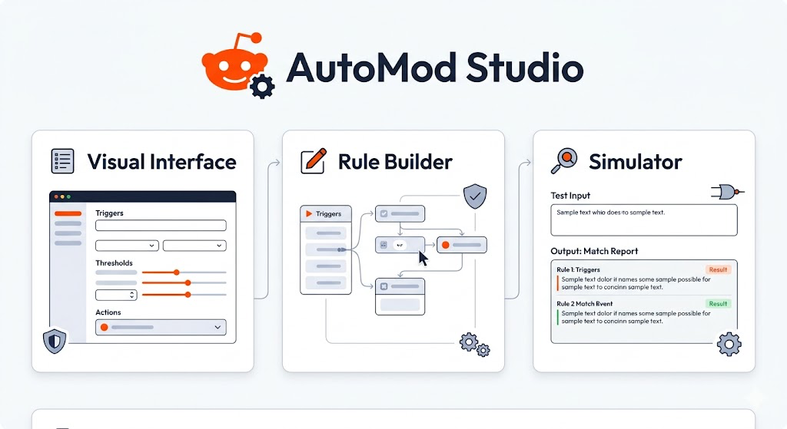
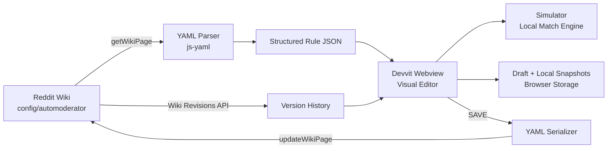
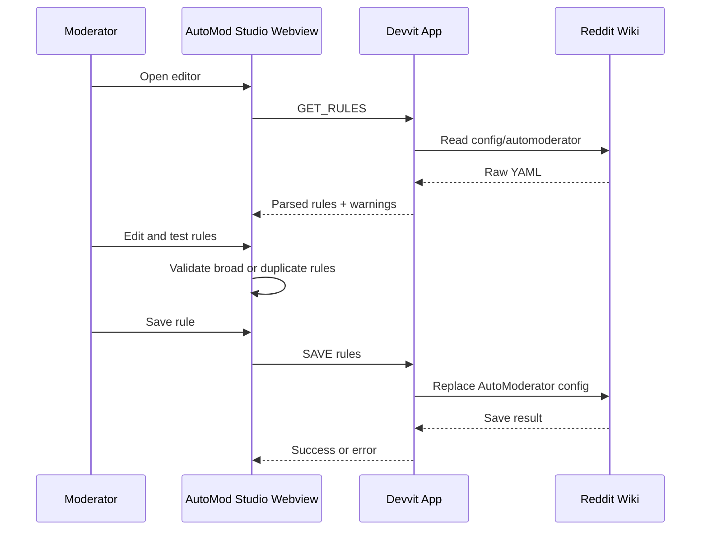

# AutoMod Studio

<p align="center">
  
</p>

<p align="center">
  <strong>A native Devvit workspace for building, testing, versioning, and deploying Reddit AutoModerator rules.</strong>
</p>

<p align="center">
  <a href="https://developers.reddit.com/"></a>
  <a href="https://www.typescriptlang.org/"></a>
  <a href="https://www.npmjs.com/package/js-yaml"></a>
  
  
</p>

<p align="center">
  
  
  
</p>

<p align="center">
  <a href="./TERMS.md">Terms</a>
  &nbsp; | &nbsp;
  <a href="./PRIVACY.md">Privacy</a>
  &nbsp; | &nbsp;
  <a href="https://developers.reddit.com/docs/">Docs</a>
  &nbsp; | &nbsp;
  <a href="https://www.reddit.com/r/Devvit/">r/Devvit</a>
</p>

---

<p align="center">
  
</p>

## Overview

AutoMod Studio turns Reddit AutoModerator from a raw YAML editing workflow into a visual, moderator-friendly control room. It reads `r/subreddit/wiki/config/automoderator`, parses the configuration into editable rule cards, lets moderators test rules against sample content, and writes validated YAML back to Reddit through Devvit.

The goal is simple: make powerful moderation automation safer, easier to review, and accessible to non-technical mod teams without moving sensitive workflow data outside Reddit.

## Why It Matters

Moderators often maintain AutoModerator by editing large YAML files directly. A small indentation mistake, malformed regex, or broad rule can break moderation for an entire community. AutoMod Studio adds a structured interface around that workflow:

| Problem | AutoMod Studio Response |
| --- | --- |
| Raw YAML is easy to break | Rules are edited through guided fields and YAML previews |
| Testing changes is manual | Simulator shows which rules would match sample content |
| Config history is hard to compare | Local snapshots and Reddit wiki revisions are shown in one timeline |
| Non-technical mods are blocked | Templates and rule cards make common policies approachable |
| Deploying is risky | Save flow warns that the full AutoModerator wiki page will be replaced |

## Product Surface

- **Templates** - starter rules for spam, new accounts, civility, link farming, flair, and title quality.
- **My Rules** - table view of the current AutoModerator config with readiness indicators.
- **Rule Builder** - guided editor for actions, metadata, author limits, body/title checks, URL checks, flair checks, and YAML preview.
- **Simulator** - approximate local matching against sample title, body, URL, and content type.
- **Version History** - combines local snapshots with Reddit wiki revisions for restore and revert workflows.
- **Settings** - workspace display controls and deployment context.

## Architecture



## Data Flow



## Tech Stack

| Layer | Technology | Purpose |
| --- | --- | --- |
| Reddit platform | Devvit `0.12.24` | Custom post, menu item, Reddit API access |
| App runtime | TypeScript | Devvit handlers, parser, serializer |
| UI | HTML, CSS, vanilla JavaScript | CSP-friendly embedded webview |
| YAML bridge | `js-yaml` | Parse and serialize AutoModerator documents |
| State | Webview state + localStorage | Draft recovery and local snapshot history |
| Reddit source of truth | Wiki API | Read, update, inspect, and revert `config/automoderator` |

## Repository Layout

```text
automod-studio/
├── assets/
│   └── ourapp.png
├── devvit.yaml
├── package.json
├── src/
│   ├── main.tsx
│   ├── serializer.ts
│   ├── parser/
│   │   └── yamlToJson.ts
│   └── types/
│       ├── automod.ts
│       └── js-yaml.d.ts
└── webroot/
    ├── index.html
    ├── index.js
    └── styles.css
```

## Core Modules

### Devvit Entry Point

`src/main.tsx` configures Reddit API access, registers the custom post type, mounts the webview, and handles messages for:

- `GET_RULES`
- `SAVE`
- `GET_WIKI_REVISIONS`
- `GET_WIKI_REVISION`
- `REVERT_WIKI`

### YAML Parser

`src/parser/yamlToJson.ts` loads multi-document AutoModerator YAML, skips invalid or empty documents with warnings, and partitions each rule into:

- raw rule document
- conditions
- actions
- metadata
- display name and stable UI id

### YAML Serializer

`src/serializer.ts` converts edited rule objects back into clean YAML documents joined with AutoModerator `---` separators.

### Webview Interface

`webroot/index.js` owns the visual editor, simulator, draft persistence, local history timeline, and shell navigation. `webroot/styles.css` provides the full light/dark design system and responsive app layout.

## Installing AutoMod Studio

AutoMod Studio is a general-purpose moderation app for communities that use Reddit AutoModerator. It is intended for moderators who are allowed to manage subreddit wiki and AutoModerator settings.

After the app is listed in the Reddit App Directory:

1. Open the app listing for **AutoMod Studio**.
2. Choose the subreddit where you want to install it.
3. Approve the requested moderator permissions.
4. Open your subreddit.
5. From the subreddit moderator menu, select **AutoMod Studio**.
6. Create an AutoMod Studio post, then click **Open Editor**.

The app reads and writes `r/YOUR_SUBREDDIT/wiki/config/automoderator`. Always review the generated YAML before saving, because deploy replaces the full AutoModerator wiki page with the rules currently loaded in the editor.

## Moderator Workflow

1. Open **Templates** to start from a common moderation pattern, or open **My rules** to review the current wiki config.
2. Edit rule action, content type, author limits, body/title patterns, URL checks, flair checks, and response text in the builder.
3. Use the inline tester or **Simulator** view to check sample content before deploy.
4. Confirm that every rule has match conditions and no duplicate blockers.
5. Click **Save rule** to update the live AutoModerator wiki page.
6. Use **Version history** to compare local snapshots and Reddit wiki revisions, restore a version to the editor, or revert a Reddit revision.

## Compatibility and Permissions

- Platform: Reddit Devvit.
- UI targets: Reddit web and mobile clients that support Devvit custom posts and webviews.
- Users: subreddit moderators for setup and rule editing.
- Required access: Reddit API, custom posts, subreddit menu actions, embedded webview, and moderator/wiki capabilities requested by Devvit.
- External services: none used by the in-app workflow.
- Persistent app storage: live rules in Reddit wiki; drafts and local snapshots in the moderator's browser storage.

## Development Setup

### Prerequisites

- Node.js 18+
- Devvit CLI
- Reddit account with moderator access to a test subreddit

```bash
npm install -g devvit
npm install
```

### Login

```bash
npm run login
```

### Upload

```bash
npm run upload
```

### Playtest

```bash
npm run dev
```

Or target your own small test subreddit:

```bash
npm run dev -- r/yoursubreddit
```

Open the playtest subreddit, go to Mod Tools, and select **AutoMod Studio**.

## Public Launch Checklist

Before submitting a public version, verify:

- Web playtest as the developer account.
- Web playtest as another moderator account.
- Web view as a regular non-moderator account.
- Mobile playtest on a subreddit where the app is installed.
- Empty AutoModerator wiki import.
- Multi-rule AutoModerator wiki import.
- Template creation, edit, simulator, save, history, restore, and revert flows.
- Terms and Privacy links from the launch card and webview.
- No test subreddit names appear before the Reddit API initializes workspace data.

## Development Commands

| Command | Description |
| --- | --- |
| `npm run login` | Authenticate the Devvit CLI |
| `npm run upload` | Upload/register the app with Reddit |
| `npm run dev` | Start Devvit playtest |
| `npm run check` | Run TypeScript type checking |

## App Listing Links

Use these URLs in the Reddit Developer Portal app details form so Reddit can show the native Terms and Privacy links on the app surface:

| Field | URL |
| --- | --- |
| Terms of Service | `https://github.com/Bop95/automod-studio/blob/main/TERMS.md` |
| Privacy Policy | `https://github.com/Bop95/automod-studio/blob/main/PRIVACY.md` |

## Publishing

For private review or unlisted release:

```bash
npx devvit publish
```

For App Directory review so any community can install AutoMod Studio:

```bash
npx devvit publish --public
```

Batch public updates into deliberate releases. Each public version enters Reddit review.

## Current Capabilities

- Read AutoModerator YAML from Reddit wiki.
- Parse multiple YAML documents into rule objects.
- Edit common AutoModerator fields through a visual builder.
- Preview generated YAML per rule.
- Detect broad rules before deployment.
- Detect duplicate rules before deployment.
- Test body, title, URL, regex, and content type matching locally.
- Preserve unsaved drafts in the browser.
- Save local history snapshots after deploy.
- Load Reddit wiki revisions and restore/revert versions.

## Safety Model

AutoMod Studio treats the Reddit wiki as the source of truth. Edits remain local until a moderator explicitly deploys. Before saving, the app warns that the entire AutoModerator page will be replaced with the rules currently loaded in the editor.

The simulator is intentionally labeled approximate. It is designed to catch common mistakes before deployment, not to claim byte-for-byte parity with Reddit's production AutoModerator engine.

## Roadmap

- Redis-backed server snapshots for shared moderator history.
- Deeper AutoModerator schema coverage.
- Safer regex analysis and ReDoS warnings.
- More complete author and submission simulation.
- Import/export rule templates.
- Permission-aware UI for config-capable moderators.
- Automated parser and serializer test fixtures.

## Changelog

### 0.1.0

- Added public launch README, installer workflow, policy links, and launch checklist.
- Added Devvit custom post launch screen with product image and legal/support links.
- Added visual rule builder, template gallery, simulator, local draft recovery, wiki save, wiki revision history, restore, and revert flows.
- Added app-specific Terms of Service and Privacy Policy.

## License

BSD-3-Clause
